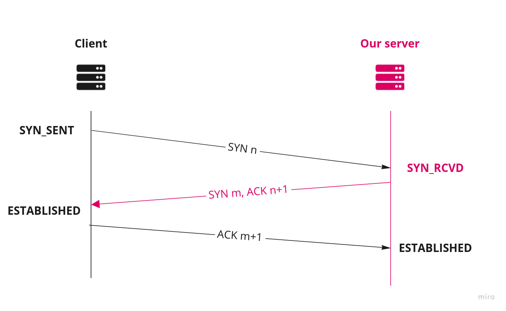
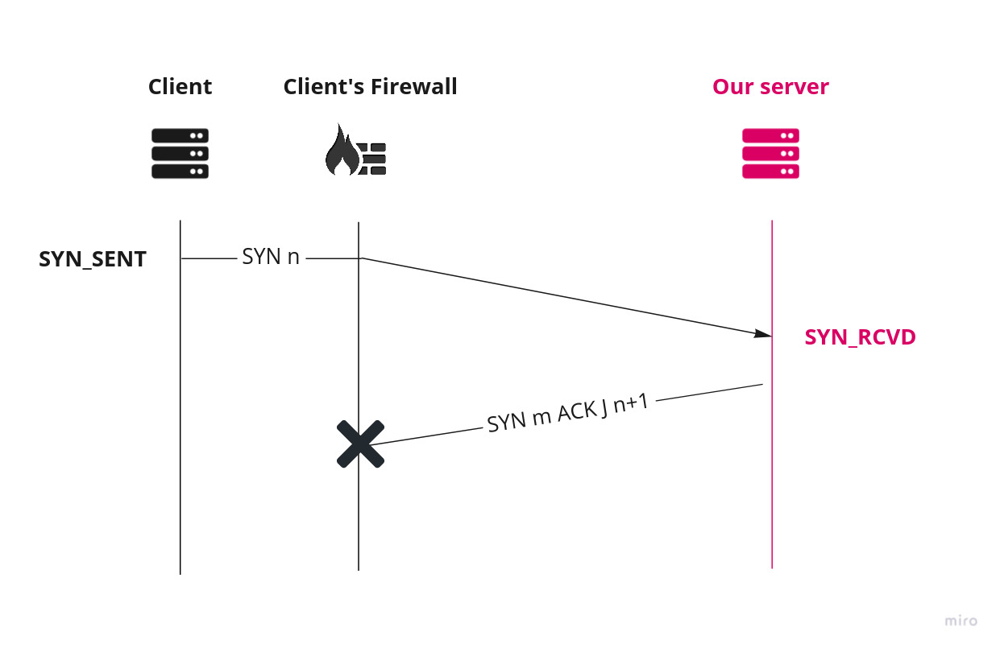
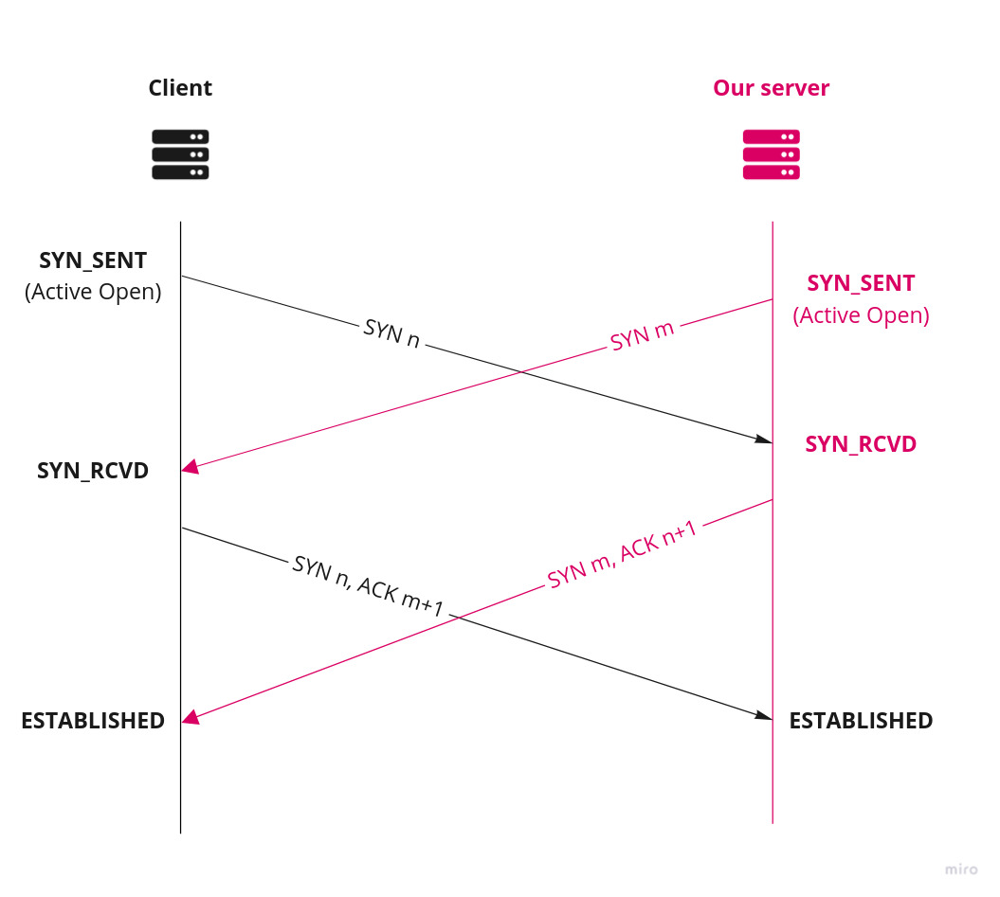

# Spending spring days crafting packets at NahamCon 2022  (1 of 3)

*A CTF writeup of Networking challenges at NahamCon2022
Part 1 of 3: Contemporaneous Open
by [f0rked](https://github.com/yetanotherf0rked) - 2022-05-01*


NahamCon2022 is over and we're glad we managed to finish in top 5% with our team (3049 points, 195 on 4034 teams). This year, they came up with three exciting Networking challenges made by **@Kkevsterrr#7469**. Although we didn't manage to solve these, it was a nice introduction to network analysis and packets manipulation using **Scapy**. 

Here's what I learned.

**Tools used:** 
- [scapy](https://github.com/secdev/scapy) for packet manipulation
- [tshark](https://tshark.dev/) wireshark's cli version

**Challenges:**
- **Contemporaneous Open** - hard - 14 solves - 500 points - first blooded by **StaticFlow**
- **Freaky Flag Day** - hard - 9 solves - 500 points - first blooded by **Maple Bacon**
- **The smuggler** - hard - 8 solves - 500 points - first blooded by **ekofisk**

## Contemporaneous Open
> **Author: @Kkevsterrr#7469** 
  >We want to give you the flag, we really do. just give us a TCP HTTP server to send it to, and we'll make a POST request with all the deets you need! we've just got a firewall issue on our side and we're dropping certain important packets (specifically, any inbound SYN+ACK packet is dropped). Shouldn't be a problem for a networking pro like you, though - just make a TCP server that doesn't need to send those!

### Traditional 3-way handshake
Let's start with some useful reminders about TCP Protocol. In a traditional TCP 3-way handshake:
1. the client sends a **SYN** (Synchronize Sequence Number) to inform the server he wants to start a communication. The SYN signifies with what sequence number it will start the segments with.
2. the server responds to the client with **SYN-ACK**. The ACK signifies the response of client's SYN. Meanwhile the SYN signifies with what sequence number it will start the segments with.
3. Finally, the client acknowledges (**ACK**) the response of the server and the connection enters the ESTABLISHED state so they can start exchanging data.



### SYN-ACK get dropped by a distrustful firewall
In this challenge the flag is given by a POST request to a server we're supposed to create at port 80. The thing is: the client's firewall drops every inbound SYN-ACK packet. So we must find a solution to establish a connection without having to send a SYN-ACK-flagged packet.



While I was spending hours refreshing my memory about TCP/IP internals, learning the basics of scapy and exploring many ways to solve the problem (fragmenting the SYN/ACK response, attempting an [HTTP3 over QUIC conection](https://www.auvik.com/franklyit/blog/what-is-quic-protocol/)), the solution was laying in the challenge's name.

### TCP Simultaneous Open
*Contemporaneous Open* is a reference to **TCP's Simultaneous Open** state transition. Also called "simultaneous active open on both side", it refers to an old TCP feature used to handle edge cases in TCP handshakes, as when a server and a client send a SYN to each other at the same time. This process makes it possible for two applications to send a SYN to each other to start a TCP connection.



When both ends send a SYN at the same time, both ends enter the SYN_SENT state. When they receive the SYN, their state changes to SYN_RCVD and they resend the SYN and aknowledge the received SYN. When they both receive the SYN and the acknowledged SYN, the connection enters the ESTABLISHED state. In such a state, both ends act as a client and server.

So the client doesn't need a SYN/ACK answer from the server in order to complete the three-way handshake. **All we need is to send a SYN and wait for the *client*'s SYN/ACK to establish the connection and start HTTP exchange.** This can save us from sending a SYN/ACK packet that would be dropped by the client. We'll use Scapy to mimic a server with such a behavior.

### Crafting with scapy
Before executing any Scapy scripts, we must disable the Linux Kernel's response to avoid any RST-flagged answers. Scapy operates in user space so the Kernel has no idea of what Scapy is doing.

Using iptables, we can drop RST-flagged packets the kernel sends from port 80.

```bash
sudo iptables -A OUTPUT -p tcp --tcp-flags RST RST --sport 80 -j DROP
```

The idea is to create a customized server that does the following:
- receive client's SYN (seq=n)
- send a SYN (seq=m)
- send a ACK (seq=m+1, ack=n+1) to acknowledge client's SYN
- client acknowledges our SYN, receives our ACK and establish session

We'll use **tshark** as a complementary tool to track the incoming packets.

### 1. First, let's get client's SYN packet.
Note that IP addresses have been changed to "MY_IP" and "CLIENT_IP".

```python
# server.py
#! /usr/bin/python
from scapy import *

S_ADDR = "MY_IP"
S_PORT = 80

# 1. Listen for client's SYN and get IP and port
c_syn = sniff(
    filter="tcp and port 80",
    count=1,
    prn=lambda x:x.sprintf("Received SYN from {IP:%IP.src%:%TCP.dport%, seq=%TCP.seq}%")
)
```

We connect to the challenge:
```bash
❯ nc challenge.nahamcon.com 31334
so glad you're here! i would love to give you the flag. just give me the IP address that's running an HTTP server, and I'll shoot you the flag immediately.
oh one snag, we've got some firewall issues on our side, and some important packets are getting dropped. shouldn't be a problem for you, though.
>>> MY_IP
here it comes!
hmm nope looks like you didn't get it...
```

```
# server.py output
Received SYN from CLIENT_IP:http, seq=510141201
```

```bash
❯ sudo tshark -f "tcp port 80"
Running as user "root" and group "root". This could be dangerous.
Capturing on 'ens3'
    1 0.000000000 CLIENT_IP → MY_IP TCP 74 58356 → 80 [SYN] Seq=0 Win=42600 Len=0 MSS=1420 SACK_PERM=1 TSval=3977333110 TSecr=0 WS=128
    2 1.015633580 CLIENT_IP → MY_IP TCP 74 [TCP Retransmission] 58356 → 80 [SYN] Seq=0 Win=42600 Len=0 MSS=1420 SACK_PERM=1 TSval=3977334125 TSecr=0 WS=128
```

Great! We now can use the IP and port for sending our packets.

### 2. Now let's send our SYN and acknowledge client's SYN

```python
# server.py
# ...

# 2. Send Syn
C_ADDR = c_syn[0][IP].src
C_PORT = c_syn[0].sport
C_SEQ = c_syn[0].seq
S_SEQ = 1234 # random number

ip = IP(src=S_ADDR, dst=C_ADDR)
tcp_syn = TCP(
    sport=S_PORT,
    dport=C_PORT,
    flags="S",
    seq=S_SEQ,
)
s_syn = send(ip/tcp_syn)

print(f"Send SYN with seq={S_SEQ}")

# 3. Send Ack
S_SEQ+=1
C_SEQ+=1
tcp_ack = TCP(
    sport=S_PORT,
    dport=C_PORT,
    flags="A",
    seq=S_SEQ,
    ack=C_SEQ,
)
s_ack = send(ip/tcp_ack)

print(f"Send ACK with seq={S_SEQ} and ack={C_SEQ}")
```

```
Received SYN from CLIENT_IP:http, seq=3800804531
Send SYN with seq=1234
Send ACK with seq=1235 and ack=3800804532
```

We'll use the flag `-z "follow,tcp,hex,0"` to display the contents of the first TCP Stream (CLIENT_IP → MY_IP)

```bash
❯ sudo tshark -f "tcp port 80" -z "follow,tcp,hex,0"
Running as user "root" and group "root". This could be dangerous.
Capturing on 'ens3'
    1 0.000000000 CLIENT_IP → MY_IP TCP 74 34206 → 80 [SYN] Seq=0 Win=42600 Len=0 MSS=1420 SACK_PERM=1 TSval=3979143134 TSecr=0 WS=128
    2 0.009865804 MY_IP → CLIENT_IP TCP 54 80 → 34206 [SYN] Seq=0 Win=8192 Len=0
    3 0.012471996 MY_IP → CLIENT_IP TCP 54 80 → 34206 [ACK] Seq=1 Ack=1 Win=8192 Len=0
    4 0.114386572 CLIENT_IP → MY_IP TCP 74 [TCP Retransmission] 34206 → 80 [SYN, ACK] Seq=0 Ack=1 Win=42600 Len=0 MSS=1420 SACK_PERM=1 TSval=3979143248 TSecr=0 WS=128
    5 0.115899112 CLIENT_IP → MY_IP TCP 268 POST / HTTP/1.1  [TCP segment of a reassembled PDU]
    6 0.115899266 CLIENT_IP → MY_IP HTTP 104 POST / HTTP/1.1  (application/x-www-form-urlencoded)
    7 0.319132750 CLIENT_IP → MY_IP TCP 318 [TCP Retransmission] 34206 → 80 [PSH, ACK] Seq=1 Ack=1 Win=333 Len=264
    8 0.727116985 CLIENT_IP → MY_IP TCP 318 [TCP Retransmission] 34206 → 80 [PSH, ACK] Seq=1 Ack=1 Win=333 Len=264
    9 1.551128826 CLIENT_IP → MY_IP TCP 318 [TCP Retransmission] 34206 → 80 [PSH, ACK] Seq=1 Ack=1 Win=333 Len=264
   10 3.119495767 CLIENT_IP → MY_IP TCP 54 34206 → 80 [FIN, ACK] Seq=265 Ack=1 Win=333 Len=0
   11 3.215170188 CLIENT_IP → MY_IP TCP 318 [TCP Retransmission] 34206 → 80 [FIN, PSH, ACK] Seq=1 Ack=1 Win=333 Len=264
^C11 packets captured

===================================================================
Follow: tcp,hex
Filter: tcp.stream eq 0
Node 0: CLIENT_IP:34206
Node 1: MY_IP:80
00000000  50 4f 53 54 20 2f 20 48  54 54 50 2f 31 2e 31 0d  POST / H TTP/1.1.
00000010  0a 48 6f 73 74 3a 20 31  36 32 2e 31 39 2e 32 37  .Host: 1 62.19.27
00000020  2e 31 34 38 0d 0a 55 73  65 72 2d 41 67 65 6e 74  .148..Us er-Agent
00000030  3a 20 70 79 74 68 6f 6e  2d 72 65 71 75 65 73 74  : python -request
00000040  73 2f 32 2e 32 37 2e 31  0d 0a 41 63 63 65 70 74  s/2.27.1 ..Accept
00000050  2d 45 6e 63 6f 64 69 6e  67 3a 20 67 7a 69 70 2c  -Encodin g: gzip,
00000060  20 64 65 66 6c 61 74 65  0d 0a 41 63 63 65 70 74   deflate ..Accept
00000070  3a 20 2a 2f 2a 0d 0a 43  6f 6e 6e 65 63 74 69 6f  : */*..C onnectio
00000080  6e 3a 20 6b 65 65 70 2d  61 6c 69 76 65 0d 0a 43  n: keep- alive..C
00000090  6f 6e 74 65 6e 74 2d 4c  65 6e 67 74 68 3a 20 35  ontent-L ength: 5
000000A0  30 0d 0a 43 6f 6e 74 65  6e 74 2d 54 79 70 65 3a  0..Conte nt-Type:
000000B0  20 61 70 70 6c 69 63 61  74 69 6f 6e 2f 78 2d 77   applica tion/x-w
000000C0  77 77 2d 66 6f 72 6d 2d  75 72 6c 65 6e 63 6f 64  ww-form- urlencod
000000D0  65 64 0d 0a 0d 0a                                 ed....
000000D6  66 6c 61 67 3d 66 6c 61  67 25 37 42 36 61 63 66  flag=fla g%7B6acf
000000E6  64 66 63 39 33 36 39 65  61 64 66 64 62 39 34 33  dfc9369e adfdb943
000000F6  39 62 30 61 63 33 39 36  39 37 31 31 25 37 44 25  9b0ac396 9711%7D%
00000106  30 41                                             0A
===================================================================
```

And so we get this lovely flag:
`flag{6acfdfc9369eadfdb9439b0ac3969711}`


### Improvements
A much more elegant solution would be to act like a real HTTP server by acquitting each client's packet, answering the POST request and then gracefully ending the connection when the client sends a FIN.

Check out **[nneonneo](https://gist.github.com/nneonneo/1b371ac9da8703eda9c3a9b26d61a483)**'s solution that implements this feature in addition to using an asynchronous sniffer that pushes incoming packets to a queue, making client's packets easier to iterate on. Also he uses many helper functions to track, filter and incoming and outcoming packets. I would definitely use these as a template for next challenges. Clean and smooth.

I would like to thank **nneonneo** and **Kkevsterrr** for their explanations. Join [Nahamsec on Discord](https://discord.gg/ysndAm8) to reach them out!

Next, we'll cover the **Freaky Flag Day** challenge.

### Further Lectures
More about this topic here:
- [TCP State Transitions - T/TCP (Transaction TCP) for Linux](http://ttcplinux.sourceforge.net/documents/one/tcpstate/tcpstate.html#:~:text=Simultaneous%20Open,active%20open%20on%20both%20sides%22.)
- [TCP/IP State Transition Diagram (RFC793)](https://users.cs.northwestern.edu/~agupta/cs340/project2/TCPIP_State_Transition_Diagram.pdf)
- [RFC-793 on ietf.org](https://datatracker.ietf.org/doc/html/rfc793)
- [The TCP/IP Guide](http://www.tcpipguide.com/index.htm)