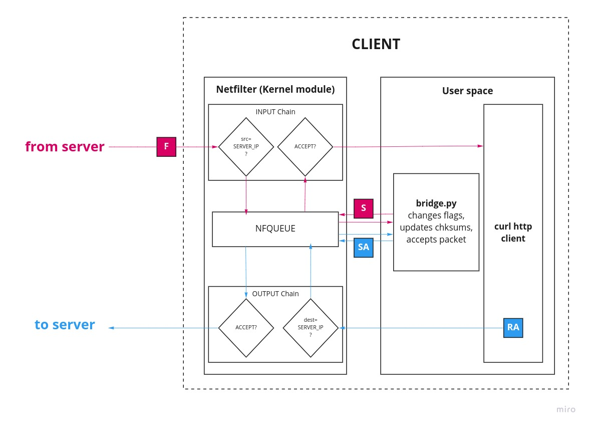

# Spending spring days crafting packets at NahamCon 2022  (2 of 3)

*A CTF writeup of Networking challenges at NahamCon2022<br/>
Part 2 of 3: Freaky Flag Day<br/>
by [f0rked](https://github.com/yetanotherf0rked) - 2022-05-05*


This is the second writeup of my NahamCon 2022's networking challenges serie. This one will cover **Freaky Flag Day**. I hope you enjoy poetry and TCP flags.

**Tools used:** 
- [scapy](https://github.com/secdev/scapy) for packet manipulation
- [tshark](https://tshark.dev/) wireshark's cli version
- [curl](https://curl.se/) for the http client
- [nfqueue](https://github.com/oremanj/python-netfilterqueue) to intercept packets queued by the kernel packet filter

**Challenges:**
- **1. Contemporaneous Open** - hard - 14 solves - 500 points - first blooded by **StaticFlow**
- **\>\>** **2. Freaky Flag Day** - hard - 9 solves - 500 points - first blooded by **Maple Bacon**
- **3. The smuggler** - hard - 8 solves - 500 points - first blooded by **ekofisk**

## Freaky Flag Days
> **Author: @Kkevsterrr#7469**  
Our TCP flags have decided that they'd like to change places today; all you need to do is reach the HTTP server!  <br/>
Roses are red, and SYNs are FINs too.  
RST+ACKs are now SYN+ACKs for you.  
ACKs are now Es, and what else have we done?  
PSH+ACKs are FIN+SYNs just for the fun.  <br/>
Hint: If you want to run this challenge from your home or a VM, make sure you are not behind a NAT that could eat your unexpected packets.<br/>
Interact with this challenge at: http://SERVER_IP

So after defeating a suspicious client that drops every incoming SYN/ACK packet, our next challenger a server that swaps the flags of every request (both inbound and outbound).

Want to establish a session? The server understands that you want to finish it.
Want to acknowledge that a packet is successfully received? The server understands that you're under a network congestion. Nonsense.

The goal is to reach the server correctly. Thus we must speak his language. The flags mapping is the following:


| |
|-------------|-----------|
| S           | F         |
| RA          | SA        |
| A           | E         |
| PA          | FS        |

### Preliminary tests
Let's try to connect to the server using **curl**.

```bash
❯ curl --local-port 44444 http://SERVER_IP
```

```bash
❯ sudo tshark -f "tcp port 80 and host SERVER_IP"
    1 0.000000000 MY_IP → SERVER_IP TCP 74 44444 → 80 [SYN] Seq=0 Win=64240 Len=0 MSS=1460 SACK_PERM=1 TSval=1756025715 TSecr=0 WS=128
    2 1.021102385 MY_IP → SERVER_IP TCP 74 [TCP Retransmission] 44444 → 80 [SYN] Seq=0 Win=64240 Len=0 MSS=1460 SACK_PERM=1 TSval=1756026736 TSecr=0 WS=128
```
As expected, nothing happens as the SYN flag is interpreted as a FYN flag on server-side.

Now let's use scapy and send a FIN-flagged with a random sequence number segment.

```python
#! /usr/bin/python
from scapy import *

C_ADDR = "MY_IP"
C_PORT = 44444
S_ADDR = "SERVER_IP"
S_PORT = 80
C_SEQ = 1234 # random

ip = IP(src=C_ADDR, dst=S_ADDR)
tcp = TCP(
    sport=C_PORT,
    dport=S_PORT,
    flags="F",
    seq=C_SEQ,
)
p = send(ip/tcp)
```

```bash
❯ sudo tshark -f "tcp port 80 and host SERVER_IP"
    1 0.000000000 MY_IP → SERVER_IP TCP 54 44444 → 80 [FIN] Seq=1 Win=8192 Len=0
    2 0.144079153 SERVER_IP → MY_IP TCP 58 80 → 44444 [RST, ACK] Seq=1 Ack=2 Win=65320 Len=0 MSS=1420
```
The server understands "SYN" and sends us RST-ACK (which is SYN-ACK). So now he must be waiting for a a ECN (which is an ACK)... And so on. You got it.

### Packet interception and modification with scapy and nfqueue
We could rewrite an HTTP client with scapy using the modified flags. But it is a long and tedious task as we must craft every request with scapy. A less painful solution would be to have a layer that intercepts every packet and just update the flags before sending/accepting them. And that's where **nfqueue** can help us.

Using a standard http client like **curl**, intercept all the incoming and outcoming packages with **nfqueue**, pass them to our **scapy** script that will change the flags accordingly and then send the modified packets to their destination.

**Netfilter Queue is an iptables target which gives the decision on packets to the userspace**. It is part of the Netfilter project that also provides iptables and nftables. It is commonly used as a proxy or for Man in the Middle attacks.

To intercept packets with nfqueue you must set firewall's chain rules accordingly. In this situation we want to intercept:
- incoming packets from SERVER_IP (INPUT chain)
- outgoing packets to SERVER_IP (OUTPUT chain)



Let's try this.

### 1. Let's set nfqueue
```python
#!/usr/bin/python3
from netfilterqueue import NetfilterQueue
from scapy import *
import os

S_ADDR = "SERVER_IP"

# Update iptables rules
output_rule = f"iptables -A OUTPUT --destination {S_ADDR} -j NFQUEUE"
input_rule = f"iptables -A INPUT --source {S_ADDR} -j NFQUEUE"
flush_rules = "iptables -F OUTPUT && iptables -F INPUT"
os.system(input_rule)
os.system(output_rule)

def callback(raw_pkt):
    # Get a scapy object from raw packet
    p = IP(raw_pkt.get_payload())
    print(p.show())
	# Tell nfqueue to accept the packet
    raw_pkt.accept()

# Init nfqueue
q = NetfilterQueue()
q.bind(0, callback)
try:
    q.run()
except KeyboardInterrupt:
    q.unbind()
    os.system(flush_rules)
```

First we update iptables rules to intercept the interesting packets to nfqueue. Then we init nfqueue and bind the queue number 0 to our callback function. We use the same queue for both incoming and outgoing packets.

In our callback function, we get a raw packet. To manipulate it, we create a scapy IP layer with the packet's payload as an argument. We print it and finally we accept the packet. If we interrupt the process (with Ctrl+C) then we unbind the queue and flush the iptables rules.

**Important:** check your INPUT and OUTPUT chain rules before flushing it as it flushes everything.

Let's see if it works.

```bash
❯ curl http://SERVER_IP --local-port 44444
```

```
# Script output
###[ IP ]### 
  version= 4
  ihl= 5
  tos= 0x0
  len= 60
  id= 60025
  flags= DF
  frag= 0
  ttl= 64
  proto= tcp
  chksum= 0xa981
  src= SERVER_IP
  dst= CLIENT_IP
  \options\
###[ TCP ]### 
     sport= 44444
     dport= http
     seq= 1190907934
     ack= 0
     dataofs= 10
     reserved= 0
     flags= S
     window= 64240
     chksum= 0xfaf1
     urgptr= 0
     options= [('MSS', 1460), ('SAckOK', b''), ('Timestamp', (2004053730, 0)), ('NOP', None), ('WScale', 7)]
```

```bash
❯ sudo tshark -f "tcp port 80 and host SERVER_IP"
    1 0.000000000 CLIENT_IP → SERVER_IP TCP 74 44444 → 80 [SYN] Seq=0 Win=64240 Len=0 MSS=1460 SACK_PERM=1 TSval=2004025682 TSecr=0 WS=128
```

Great! Curl tries to initiate the session with the server using a SYN-flagged packet. When the packet reaches the `raw_pkt.accept()` instruction, it is sent to the client and we can notice it in **tshark**'s output.

### 2. Changing the flag
In our callback function, let's try changing the packet's flag with 'F' and see what happens.
```python
def callback(raw_pkt):
    # Get a scapy object from raw packet
    p = IP(raw_pkt.get_payload())
    print(p.show())                                                                  
    # Set S flag to F flag
    if p.haslayer(TCP):
		if p[TCP].flags = "S"
            p[TCP].flags = "F"
		
	# Update raw packet and then accept it
	raw_pkt.set_payload(bytes(p))
	raw_pkt.accept()
```

```bash
❯ sudo tshark -f "tcp port 80 and host SERVER_IP"
    1 0.000000000 CLIENT_IP → SERVER_IP TCP 74 44444 → 80 [FIN] Seq=1 Win=64240 Len=0 MSS=1460 SACK_PERM=1 TSval=2005103907 TSecr=0 WS=128
    2 1.005513362 CLIENT_IP → SERVER_IP TCP 74 [TCP Retransmission] 44444 → 80 [FIN] Seq=1 Win=8222720 Len=0 MSS=1460 SACK_PERM=1 TSval=2005104912 TSecr=0 WS=128
```

Something is wrong, we send a FIN but get no answer... Oh right! checksums, of course. Let's update checksums accordingly.

### 3. Update checksums

```python
# Set S flag to F flag
    if p.haslayer(TCP):
		if p[TCP].flags = "S"
            p[TCP].flags = "F"
		# Update checksums
        del p[IP].chksum     
        del p[TCP].chksum    
        p.show2()
```

I use the function `show2()` that recalculate checksums if they are none. This is functional but loud as it also prints the packet. I didn't find any other solution that does it quietly.

Let's try now.

```bash
❯ sudo tshark -f "tcp port 80 and host SERVER_IP"
    1 0.000000000 CLIENT_IP → SERVER_IP TCP 74 44444 → 80 [FIN] Seq=1 Win=64240 Len=0 MSS=1460 SACK_PERM=1 TSval=2005448037 TSecr=0 WS=128
    2 0.154677103 SERVER_IP → CLIENT_IP TCP 74 80 → 44444 [RST, ACK] Seq=1 Ack=2 Win=64768 Len=0 MSS=1420 SACK_PERM=1 TSval=1006897750 TSecr=2005448037 WS=128

```

Yes! The server answers us back with a RST-ACK. But our curl client still doesn't understand what he means by that. Let's map all the flags accordingly now.

### 4. Map all the flags (final code)

```python
#!/usr/bin/python3
from netfilterqueue import NetfilterQueue
from scapy import *
import os

S_ADDR = "SERVER_IP"

# Update iptables rules to intercept incoming and outcoming packets from/to S_ADDR
output_rule = f"iptables -A OUTPUT --destination {S_ADDR} -j NFQUEUE"
input_rule = f"iptables -A INPUT --source {S_ADDR} -j NFQUEUE"
flush_rules = "iptables -F OUTPUT && iptables -F INPUT"
os.system(input_rule)
os.system(output_rule)

# Dictionary with flag mapping
fd = {
    "S":"F",
    "RA":"SA",
    "A":"E",
    "PA":"FS"
}
# Append the inverted dictionnary
fd.update(dict((v,k) for k,v in fd.items()))

# Helper function to set the flags accordingly
def set_flags(flags):
    return fd[flags] if flags in fd else flags

# Callback function that modifies our packets before sending them
def callback(raw_pkt):
    # Get a scapy raw packet that we can modify
    p = IP(raw_pkt.get_payload())
    # Set flags accordingly
    if p.haslayer(TCP):
       	p[TCP].flags = set_flags(str(p[TCP].flags))
		# Calculate new chksums
		del p[IP].chksum
		del p[TCP].chksum
		p.show2()
		# Update 
		raw_pkt.set_payload(bytes(p))
		
	# Now we tell nfqueue to accept the modified packet
    raw_pkt.accept()

# Init nfqueue
q = NetfilterQueue()
q.bind(0, callback)
try:
    q.run()
except KeyboardInterrupt:
    q.unbind()
    os.system(flush_rules)
```

We use a dictionary to map all the flags. And then we use the `Dict.update()` method to add the same tuples but with the keys and values swaped. (e.g. `"S":"F"` adds `"F":"S"`).

Let's try our new code now.

```bash
❯ curl http://SERVER_IP --local-port 44444
```
```html
<!doctype html>
<html>
  <head>
    <title>FreakyFlagday</title>
  </head>
  <body>
    <p>It's freakyflagday and you've made it so far! Well done. All you've gotta do is download the text file from '/gimmedafile.txt' and it'll send you a big important file with the flag at the very end.</p>
  </body>
</html>
```

```bash
❯ sudo tshark -f "tcp port 80 and host SERVER_IP"
    1 0.000000000 MY_IP → SERVER_IP TCP 74 44444 → 80 [FIN] Seq=1 Win=64240 Len=0 MSS=1460 SACK_PERM=1 TSval=1784676225 TSecr=0 WS=128
    2 0.145262609 SERVER_IP → MY_IP TCP 74 80 → 44444 [RST, ACK] Seq=1 Ack=2 Win=64768 Len=0 MSS=1420 SACK_PERM=1 TSval=786145437 TSecr=1784676225 WS=128
    3 0.160854317 MY_IP → SERVER_IP TCP 66 44444 → 80 [ECN] Seq=2 Win=64256 Len=0 TSval=1784676385 TSecr=786145437
    4 0.170014574 MY_IP → SERVER_IP HTTP 144 [TCP Port numbers reused] GET / HTTP/1.1 
    5 0.287621647 SERVER_IP → MY_IP TCP 66 80 → 44444 [ECN] Seq=1 Win=506 Len=0 TSval=786145607 TSecr=1784676385
    6 0.290354873 SERVER_IP → MY_IP HTTP 220 [TCP Port numbers reused] HTTP/1.1 200 OK 
    7 0.311377282 MY_IP → SERVER_IP TCP 66 [TCP Keep-Alive] 44444 → 80 [ECN] Seq=78 Win=501 Len=0 TSval=1784676535 TSecr=786145609
    8 0.426628596 SERVER_IP → MY_IP TCP 376 [TCP Port numbers reused] 80 → 44444 [FIN, SYN] Seq=0 Win=506 Len=310 TSval=786145748 TSecr=1784676535
    9 0.444996568 MY_IP → SERVER_IP TCP 66 [TCP Keep-Alive] 44444 → 80 [ECN] Seq=78 Win=501 Len=0 TSval=1784676668 TSecr=786145748
   10 0.449897000 MY_IP → SERVER_IP TCP 66 [TCP ACKed unseen segment] [TCP Retransmission] 44444 → 80 [FIN, ACK] Seq=78 Ack=465 Win=501 Len=0 TSval=1784676669 TSecr=786145748
   11 0.562439239 SERVER_IP → MY_IP TCP 66 [TCP Retransmission] 80 → 44444 [FIN, ACK] Seq=310 Ack=1 Win=506 Len=0 TSval=786145885 TSecr=1784676669
   12 0.583268378 MY_IP → SERVER_IP TCP 66 44444 → 80 [ECN] Seq=79 Win=501 Len=0 TSval=1784676807 TSecr=786145885
```

Seems like it worked pretty well. The flag seems to be in this `gimmedafile.txt` file. Let's try and get the file.

```bash
❯ curl http://SERVER_IP/gimmedafile.txt --local-port 44445
Voluptatem ipsum [...39404 characters...] dolor ut.

flag{e2960da061a85fbcabb0670e4ddb9e93}
```

```bash
❯ sudo tshark -f "tcp port 80 and host SERVER_IP"
    1 0.000000000 MY_IP → SERVER_IP TCP 74 44445 → 80 [FIN] Seq=1 Win=64240 Len=0 MSS=1460 SACK_PERM=1 TSval=1784824675 TSecr=0 WS=128
    2 0.142799620 SERVER_IP → MY_IP TCP 74 80 → 44445 [RST, ACK] Seq=1 Ack=2 Win=64768 Len=0 MSS=1420 SACK_PERM=1 TSval=786293873 TSecr=1784824675 WS=128
    3 0.159637964 MY_IP → SERVER_IP TCP 66 44445 → 80 [ECN] Seq=2 Win=64256 Len=0 TSval=1784824834 TSecr=786293873
    4 0.165712720 MY_IP → SERVER_IP HTTP 159 [TCP Port numbers reused] GET /gimmedafile.txt HTTP/1.1 
    5 0.278158205 SERVER_IP → MY_IP TCP 66 80 → 44445 [ECN] Seq=1 Win=506 Len=0 TSval=786294039 TSecr=1784824834
    6 0.281436371 SERVER_IP → MY_IP HTTP 227 [TCP Port numbers reused] HTTP/1.1 200 OK 
    7 0.286101671 SERVER_IP → MY_IP TCP 1474 80 → 44445 [ECN] Seq=161 Win=506 Len=1408 TSval=786294048 TSecr=1784824834
    8 0.290101742 SERVER_IP → MY_IP TCP 1474 80 → 44445 [ECN] Seq=1569 Win=506 Len=1408 TSval=786294052 TSecr=1784824834
    9 0.293428900 SERVER_IP → MY_IP TCP 1474 80 → 44445 [ECN] Seq=2977 Win=506 Len=1408 TSval=786294056 TSecr=1784824834
   10 0.300100620 SERVER_IP → MY_IP TCP 1474 80 → 44445 [ECN] Seq=4385 Win=506 Len=1408 TSval=786294060 TSecr=1784824834
   11 0.303058929 SERVER_IP → MY_IP TCP 1474 80 → 44445 [ECN] Seq=5793 Win=506 Len=1408 TSval=786294060 TSecr=1784824834
   12 0.305803295 SERVER_IP → MY_IP TCP 1474 80 → 44445 [ECN] Seq=7201 Win=506 Len=1408 TSval=786294061 TSecr=1784824834
   13 0.308359956 SERVER_IP → MY_IP TCP 1474 80 → 44445 [ECN] Seq=8609 Win=506 Len=1408 TSval=786294061 TSecr=1784824834
   14 0.311371415 SERVER_IP → MY_IP TCP 1474 80 → 44445 [ECN] Seq=10017 Win=506 Len=1408 TSval=786294067 TSecr=1784824834
   15 0.314342631 SERVER_IP → MY_IP TCP 1474 80 → 44445 [ECN] Seq=11425 Win=506 Len=1408 TSval=786294070 TSecr=1784824834
   16 0.317448713 MY_IP → SERVER_IP TCP 66 [TCP Keep-Alive] 44445 → 80 [ECN] Seq=93 Win=501 Len=0 TSval=1784824974 TSecr=786294043
   17 0.322497523 MY_IP → SERVER_IP TCP 66 [TCP Keep-Alive] 44445 → 80 [ECN] Seq=93 Win=497 Len=0 TSval=1784824980 TSecr=786294048
   18 0.345296346 MY_IP → SERVER_IP TCP 66 [TCP Keep-Alive] 44445 → 80 [ECN] Seq=93 Win=497 Len=0 TSval=1784824986 TSecr=786294052
   19 0.363030999 MY_IP → SERVER_IP TCP 66 [TCP Keep-Alive] 44445 → 80 [ECN] Seq=93 Win=497 Len=0 TSval=1784824992 TSecr=786294056
   20 0.374327694 MY_IP → SERVER_IP TCP 66 [TCP Keep-Alive] 44445 → 80 [ECN] Seq=93 Win=497 Len=0 TSval=1784825009 TSecr=786294060
   21 0.379388653 MY_IP → SERVER_IP TCP 66 [TCP Keep-Alive] 44445 → 80 [ECN] Seq=93 Win=497 Len=0 TSval=1784825014 TSecr=786294060
   22 0.384474051 MY_IP → SERVER_IP TCP 66 [TCP Keep-Alive] 44445 → 80 [ECN] Seq=93 Win=497 Len=0 TSval=1784825020 TSecr=786294061
   23 0.389563243 MY_IP → SERVER_IP TCP 66 [TCP Keep-Alive] 44445 → 80 [ECN] Seq=93 Win=497 Len=0 TSval=1784825031 TSecr=786294061
   24 0.395089952 MY_IP → SERVER_IP TCP 66 [TCP Keep-Alive] 44445 → 80 [ECN] Seq=93 Win=497 Len=0 TSval=1784825038 TSecr=786294067
   25 0.400325803 MY_IP → SERVER_IP TCP 66 [TCP Keep-Alive] 44445 → 80 [ECN] Seq=93 Win=497 Len=0 TSval=1784825049 TSecr=786294070
   26 0.429292547 SERVER_IP → MY_IP TCP 1474 80 → 44445 [ECN] Seq=12833 Win=506 Len=1408 TSval=786294190 TSecr=1784824974
   27 0.432396491 SERVER_IP → MY_IP TCP 1474 80 → 44445 [ECN] Seq=14241 Win=506 Len=1408 TSval=786294190 TSecr=1784824974
   28 0.435011224 SERVER_IP → MY_IP TCP 1474 80 → 44445 [ECN] Seq=15649 Win=506 Len=1408 TSval=786294195 TSecr=1784824980
   29 0.437501469 SERVER_IP → MY_IP TCP 1474 80 → 44445 [ECN] Seq=17057 Win=506 Len=1408 TSval=786294195 TSecr=1784824980
   30 0.455718674 SERVER_IP → MY_IP TCP 1276 [TCP Port numbers reused] 80 → 44445 [FIN, SYN] Seq=0 Win=506 Len=1210 TSval=786294218 TSecr=1784824986
   31 0.459562289 SERVER_IP → MY_IP TCP 1474 80 → 44445 [ECN] Seq=1210 Win=506 Len=1408 TSval=786294222 TSecr=1784824986
   32 0.473141161 MY_IP → SERVER_IP TCP 66 [TCP Keep-Alive] 44445 → 80 [ECN] Seq=93 Win=497 Len=0 TSval=1784825125 TSecr=786294190
   33 0.473160024 SERVER_IP → MY_IP TCP 1474 80 → 44445 [ECN] Seq=2618 Win=506 Len=1408 TSval=786294235 TSecr=1784824992
   34 0.476471278 SERVER_IP → MY_IP TCP 1474 80 → 44445 [ECN] Seq=4026 Win=506 Len=1408 TSval=786294235 TSecr=1784824992
   35 0.478176107 MY_IP → SERVER_IP TCP 66 [TCP Keep-Alive] 44445 → 80 [ECN] Seq=93 Win=497 Len=0 TSval=1784825133 TSecr=786294190
   36 0.483052912 SERVER_IP → MY_IP TCP 1474 80 → 44445 [ECN] Seq=5434 Win=506 Len=1408 TSval=786294246 TSecr=1784825009
   37 0.489734170 MY_IP → SERVER_IP TCP 66 [TCP Keep-Alive] 44445 → 80 [ECN] Seq=93 Win=497 Len=0 TSval=1784825140 TSecr=786294195
   38 0.490446940 SERVER_IP → MY_IP TCP 1474 80 → 44445 [ECN] Seq=6842 Win=506 Len=1408 TSval=786294246 TSecr=1784825009
   39 0.495628297 SERVER_IP → MY_IP TCP 1474 80 → 44445 [ECN] Seq=8250 Win=506 Len=1408 TSval=786294252 TSecr=1784825014
   40 0.498457646 SERVER_IP → MY_IP TCP 1474 80 → 44445 [ECN] Seq=9658 Win=506 Len=1408 TSval=786294252 TSecr=1784825014
   41 0.502477260 MY_IP → SERVER_IP TCP 66 [TCP Keep-Alive] 44445 → 80 [ECN] Seq=93 Win=497 Len=0 TSval=1784825148 TSecr=786294195
   42 0.503250048 SERVER_IP → MY_IP TCP 1474 80 → 44445 [ECN] Seq=11066 Win=506 Len=1408 TSval=786294256 TSecr=1784825020
   43 0.508097290 SERVER_IP → MY_IP TCP 1474 80 → 44445 [ECN] Seq=12474 Win=506 Len=1408 TSval=786294261 TSecr=1784825031
   44 0.529693000 MY_IP → SERVER_IP TCP 66 [TCP Keep-Alive] 44445 → 80 [ECN] Seq=93 Win=497 Len=0 TSval=1784825165 TSecr=786294218
   45 0.547629433 MY_IP → SERVER_IP TCP 66 [TCP Keep-Alive] 44445 → 80 [ECN] Seq=93 Win=497 Len=0 TSval=1784825177 TSecr=786294222
   46 0.569959311 MY_IP → SERVER_IP TCP 66 [TCP Keep-Alive] 44445 → 80 [ECN] Seq=93 Win=497 Len=0 TSval=1784825198 TSecr=786294235
   47 0.574834351 MY_IP → SERVER_IP TCP 66 [TCP Keep-Alive] 44445 → 80 [ECN] Seq=93 Win=497 Len=0 TSval=1784825216 TSecr=786294246
   48 0.582698364 MY_IP → SERVER_IP TCP 66 [TCP Keep-Alive] 44445 → 80 [ECN] Seq=93 Win=497 Len=0 TSval=1784825234 TSecr=786294252
   49 0.590039492 MY_IP → SERVER_IP TCP 66 [TCP Keep-Alive] 44445 → 80 [ECN] Seq=93 Win=497 Len=0 TSval=1784825245 TSecr=786294256
   50 0.640226149 SERVER_IP → MY_IP TCP 651 [TCP Port numbers reused] 80 → 44445 [FIN, SYN] Seq=0 Win=506 Len=585 TSval=786294402 TSecr=1784825165
   51 0.663333652 MY_IP → SERVER_IP TCP 66 [TCP Keep-Alive] 44445 → 80 [ECN] Seq=93 Win=501 Len=0 TSval=1784825334 TSecr=786294402
   52 0.669714648 MY_IP → SERVER_IP TCP 66 [TCP ACKed unseen segment] [TCP Retransmission] 44445 → 80 [FIN, ACK] Seq=93 Ack=32933 Win=501 Len=0 TSval=1784825335 TSecr=786294402
   53 0.776541498 SERVER_IP → MY_IP TCP 66 [TCP Retransmission] 80 → 44445 [FIN, ACK] Seq=585 Ack=1 Win=506 Len=0 TSval=786294541 TSecr=1784825335
   54 0.793113070 MY_IP → SERVER_IP TCP 66 44445 → 80 [ECN] Seq=94 Win=501 Len=0 TSval=1784825466 TSecr=786294541
```
   
And voilà! Here's the second flag: `flag{e2960da061a85fbcabb0670e4ddb9e93}`

Next we'll see the third and ultimate challenge which will include.. * \*drumrolls\* *.. DNS requests! 


### Further Lectures
- [Using nfqueue with python](https://byt3bl33d3r.github.io/using-nfqueue-with-python-the-right-way.html)
- [Scapy docs](https://scapy.readthedocs.io/)
- [About calculating checksums with Scapy on Stack Overflow](https://stackoverflow.com/questions/5953371/how-to-calculate-a-packet-checksum-without-sending-it)
- [python-netfilterqueue on Github](https://github.com/oremanj/python-netfilterqueue)
- [Netfilter project](https://www.netfilter.org/)
- [TCP Flags on KeyCDN](https://www.keycdn.com/support/tcp-flags)